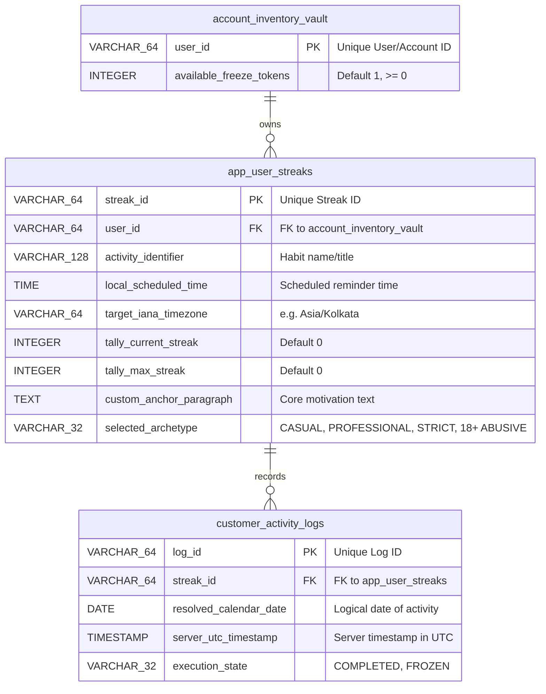

# LockedIn Platform - Database Design Specification

## Document Control & Metadata
- **Title:** LockedIn Platform Database Design Specification
- **Status:** Approved / Production Blueprint
- **Version:** v2.0.0
- **Authors:** Database Architect & SRE Lead
- **Date:** June 2026

---

## 1. Entity-Relationship Diagram (ERD)

The database schema is designed in Third Normal Form (3NF) to maintain referential integrity while using indexing and locking strategies to optimize write throughput.



---

## 2. PostgreSQL DDL Schema Definition

```sql
-- Enable UUID extension if required for primary keys
CREATE EXTENSION IF NOT EXISTS "uuid-ossp";

-- 1. Guarded Asset Inventory Vault (Streak Freezes)
-- This table tracks available protection tokens for each user.
CREATE TABLE account_inventory_vault (
    user_id VARCHAR(64) PRIMARY KEY,
    available_freeze_tokens INT DEFAULT 1 NOT NULL,
    -- Database integrity guardrail preventing negative asset depletion loops
    CONSTRAINT asset_floor_limit CHECK (available_freeze_tokens >= 0)
);

-- 2. Main User Streak Configuration Table
-- Stores the habit metadata, selected archetype, and scheduling rules.
CREATE TABLE app_user_streaks (
    streak_id VARCHAR(64) PRIMARY KEY,
    user_id VARCHAR(64) NOT NULL REFERENCES account_inventory_vault(user_id) ON DELETE CASCADE,
    activity_identifier VARCHAR(128) NOT NULL,
    local_scheduled_time TIME NOT NULL,
    target_iana_timezone VARCHAR(64) NOT NULL,
    tally_current_streak INT DEFAULT 0 NOT NULL,
    tally_max_streak INT DEFAULT 0 NOT NULL,
    custom_anchor_paragraph TEXT,
    selected_archetype VARCHAR(32) DEFAULT 'PROFESSIONAL' NOT NULL,
    
    CONSTRAINT chk_streaks_non_negative CHECK (tally_current_streak >= 0 AND tally_max_streak >= 0)
);

-- 3. Granular Daily Activity Verification Log
-- Tracks check-ins and frozen days. Prevents multiple logs per calendar day.
CREATE TABLE customer_activity_logs (
    log_id VARCHAR(64) PRIMARY KEY,
    streak_id VARCHAR(64) NOT NULL REFERENCES app_user_streaks(streak_id) ON DELETE CASCADE,
    resolved_calendar_date DATE NOT NULL,
    server_utc_timestamp TIMESTAMP WITH TIME ZONE DEFAULT CURRENT_TIMESTAMP NOT NULL,
    execution_state VARCHAR(32) NOT NULL, -- 'COMPLETED', 'FROZEN'
    
    -- Hard safety block preventing duplicate check-ins or freezes on the same calendar day
    CONSTRAINT unique_streak_per_day UNIQUE (streak_id, resolved_calendar_date),
    CONSTRAINT chk_execution_state CHECK (execution_state IN ('COMPLETED', 'FROZEN'))
);
```

---

## 3. Query & Performance Index Optimizations

To meet the NFR performance requirements (**P99 latency < 150ms** and high-throughput background polling), we define the following indices:

### 3.1 Polling Optimizer Index
The minute-polling daemon executes the following lookup pattern query every 60 seconds:
```sql
SELECT us.user_id, us.streak_id, us.selected_archetype 
FROM app_user_streaks us 
LEFT JOIN customer_activity_logs sl ON us.streak_id = sl.streak_id AND sl.resolved_calendar_date = CURRENT_DATE 
WHERE us.local_scheduled_time = ? AND sl.log_id IS NULL;
```
To optimize this, we create:
```sql
-- Index on app_user_streaks to find records scheduled for the current minute instantly
CREATE INDEX idx_streaks_schedule_lookup 
ON app_user_streaks (local_scheduled_time);

-- Composite index on customer_activity_logs for fast left-join resolution on logical dates
CREATE INDEX idx_logs_streak_date_lookup 
ON customer_activity_logs (streak_id, resolved_calendar_date);
```

### 3.2 User Profile & Inventory Indexes
```sql
-- Index for quick lookups of all streaks belonging to a specific user
CREATE INDEX idx_streaks_user_lookup 
ON app_user_streaks (user_id);
```

---

## 4. Transactional Locking & Concurrency Design

### 4.1 Streak Freeze Deductions
To prevent race conditions where a user tries to consume a single freeze token twice across multiple threads, we use row-level pessimistic locking via `FOR UPDATE` within serializable or read-committed transactions:

1. **Transaction Begin:** `conn.setAutoCommit(false)`
2. **Pessimistic Lock Row:**
   ```sql
   SELECT available_freeze_tokens 
   FROM account_inventory_vault 
   WHERE user_id = ? 
   FOR UPDATE;
   ```
3. **Verify & Decrement:** If tokens > 0, execute update:
   ```sql
   UPDATE account_inventory_vault 
   SET available_freeze_tokens = available_freeze_tokens - 1 
   WHERE user_id = ?;
   ```
4. **Insert Log:** Insert record into `customer_activity_logs`.
5. **Commit:** Commit transaction. If any SQLException occurs, rollback immediately.
