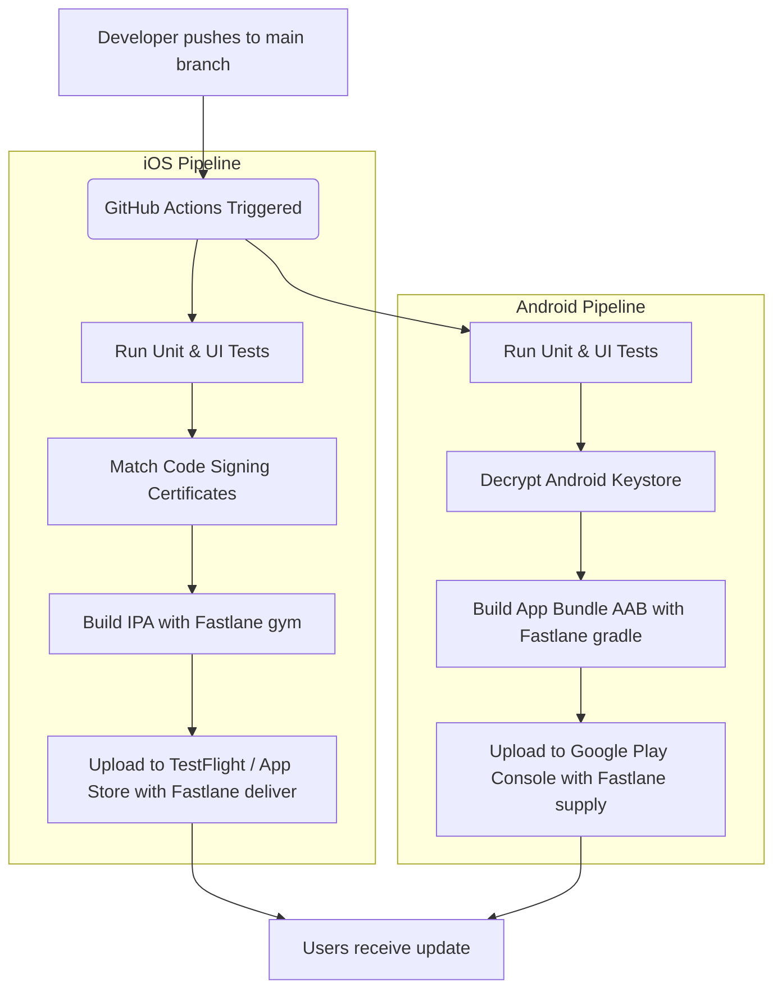

# Mobile App Deployment Pipeline Specification (iOS & Android)

This document outlines the end-to-end automated deployment pipeline for shipping the **LockedIn** mobile applications to the **Apple App Store** (iOS) and **Google Play Store** (Android). 

Since mobile deployment involves code signing, credentials management, and platform-specific release tracks, we utilize **Fastlane** (the industry-standard automation tool) orchestrated via **GitHub Actions** for our Continuous Integration and Continuous Deployment (CI/CD) pipelines.

---

## 1. High-Level CI/CD Workflow



---

## 2. Prerequisites & Credentials Checklist

To run this pipeline, you need specific developer accounts and security credentials. Below is a checklist of what must be set up.

### 🍏 iOS / Apple App Store Requirements
1. **Apple Developer Program Account**: Required to distribute apps ($99/year).
2. **App Store Connect API Key**: Used by Fastlane to authenticate with Apple APIs without 2FA prompts.
3. **App Store Connect App ID**: The Bundle Identifier (e.g., `com.lockedin.app`).
4. **iOS Code Signing Certificates**:
   * **Development & Distribution Certificates** and **Provisioning Profiles**.
   * We use **Fastlane Match** which stores these certificates in a private, encrypted Git repository to share them securely across developers and the CI/CD server.

### 🤖 Android / Google Play Store Requirements
1. **Google Play Console Developer Account**: Required to publish ($25 one-time fee).
2. **Google Play Developer API Service Account Key (JSON)**: Allows Fastlane to upload builds directly to the Play Console.
3. **Android App Upload Keystore**:
   * A `.jks` or `.keystore` file used to sign the production release.
   * Keystore credentials (`storePassword`, `keyAlias`, `keyPassword`).

---

## 3. Fastlane Configuration Blueprint

Fastlane uses a file called `Fastfile` to define the steps (called "lanes") for building and releasing your app.

### 🍏 iOS `fastlane/Fastfile` Blueprint
```ruby
default_platform(:ios)

platform :ios do
  desc "Run tests, fetch certificates, build, and push to TestFlight (Beta)"
  lane :beta do
    # 1. Sync certificates using Fastlane Match (read-only mode in CI)
    match(type: "appstore", readonly: true)
    
    # 2. Increment build number automatically
    increment_build_number(build_number: ENV["GITHUB_RUN_NUMBER"])
    
    # 3. Build the iOS App (.ipa)
    build_app(
      scheme: "LockedIn",
      workspace: "LockedIn.xcworkspace",
      include_bitcode: false
    )
    
    # 4. Upload to App Store Connect (TestFlight)
    upload_to_testflight(
      api_key_path: "fastlane/app_store_connect_api_key.json"
    )
  end

  desc "Promote beta build to App Store Production"
  lane :release do
    deliver(
      submit_for_review: true,
      force: true,
      skip_binary_upload: true # Promotes the existing TestFlight build
    )
  end
end
```

### 🤖 Android `fastlane/Fastfile` Blueprint
```ruby
default_platform(:android)

platform :android do
  desc "Run tests, build Android App Bundle (AAB), and deploy to Play Store Internal Track"
  lane :internal do
    # 1. Build release AAB using Gradle
    gradle(
      task: "bundle",
      build_type: "Release"
    )
    
    # 2. Upload to Google Play Store (Internal Track)
    upload_to_play_store(
      track: "internal",
      json_key: "fastlane/google_play_api_key.json",
      package_name: "com.lockedin.app"
    )
  end

  desc "Promote Android Internal build to Production track"
  lane :release do
    upload_to_play_store(
      track: "production",
      rollout: "0.1", # Starts a 10% staged rollout
      json_key: "fastlane/google_play_api_key.json",
      package_name: "com.lockedin.app"
    )
  end
end
```

---

## 4. GitHub Actions CI/CD Pipeline

To automate execution of these lanes on every push to the `main` branch, we define the following workflows under `.github/workflows/`.

### 🍏 iOS Deployment Workflow (`.github/workflows/deploy_ios.yml`)
```yaml
name: iOS Deploy

on:
  push:
    branches: [ main ]

jobs:
  deploy:
    runs-on: macos-latest
    steps:
      - name: Checkout Source Code
        uses: actions/checkout@v3

      - name: Set up Ruby & Bundler
        uses: ruby/setup-ruby@v1
        with:
          ruby-version: '3.2'
          bundler-cache: true

      - name: Install Pods (iOS Dependencies)
        run: |
          cd ios
          pod install --repo-update

      - name: Import App Store Connect API Key
        run: |
          echo "${{ secrets.APP_STORE_CONNECT_API_KEY_JSON }}" > fastlane/app_store_connect_api_key.json

      - name: Setup SSH for Certificates Repo (Fastlane Match)
        uses: webfactory/ssh-agent@v0.7.0
        with:
          ssh-private-key: ${{ secrets.MATCH_GIT_PRIVATE_KEY }}

      - name: Run Fastlane Beta Lane
        env:
          MATCH_PASSWORD: ${{ secrets.MATCH_PASSWORD }}
          GITHUB_RUN_NUMBER: ${{ github.run_number }}
        run: bundle exec fastlane ios beta
```

### 🤖 Android Deployment Workflow (`.github/workflows/deploy_android.yml`)
```yaml
name: Android Deploy

on:
  push:
    branches: [ main ]

jobs:
  deploy:
    runs-on: ubuntu-latest
    steps:
      - name: Checkout Source Code
        uses: actions/checkout@v3

      - name: Set up Java
        uses: actions/setup-java@v3
        with:
          distribution: 'zulu'
          java-version: '17'

      - name: Set up Ruby & Bundler
        uses: ruby/setup-ruby@v1
        with:
          ruby-version: '3.2'
          bundler-cache: true

      - name: Decrypt Android Keystore
        run: |
          echo "${{ secrets.ANDROID_KEYSTORE_BASE64 }}" | base64 --decode > android/app/release.keystore

      - name: Import Google Play Console JSON Key
        run: |
          echo "${{ secrets.GOOGLE_PLAY_API_KEY_JSON }}" > fastlane/google_play_api_key.json

      - name: Run Fastlane Android Internal Lane
        env:
          KEYSTORE_PASSWORD: ${{ secrets.KEYSTORE_PASSWORD }}
          KEYSTORE_ALIAS: ${{ secrets.KEYSTORE_ALIAS }}
          KEY_PASSWORD: ${{ secrets.KEY_PASSWORD }}
        run: bundle exec fastlane android internal
```

---

## 5. Security & Secret Management Guide

**CRITICAL WARNING**: Never commit keystores, certificates, private keys, or passwords to git repositories directly. Instead, store them in **GitHub Secrets** under your repository settings:

1. **`APP_STORE_CONNECT_API_KEY_JSON`**: The JSON block containing Apple App Store API credentials.
2. **`MATCH_GIT_PRIVATE_KEY`**: The SSH private key to pull your iOS signing certificates Git repository.
3. **`MATCH_PASSWORD`**: The password key used to encrypt/decrypt files in the certificates repository.
4. **`GOOGLE_PLAY_API_KEY_JSON`**: The Google Service Account JSON configuration file.
5. **`ANDROID_KEYSTORE_BASE64`**: The Android upload keystore file converted to a Base64 string for safe text storage.
6. **`KEYSTORE_PASSWORD` / `KEY_PASSWORD`**: Passwords for code-signing Android builds.
