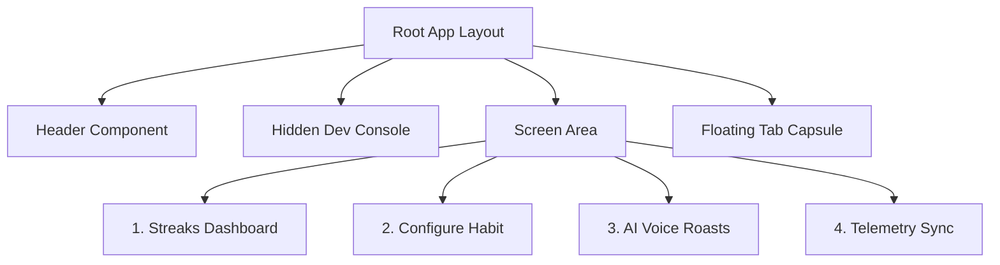

# Master UI Design Specification: LockedIn Mobile Client

This document outlines the UI design system, layout specifications, and screen structures for the **LockedIn** cross-platform mobile client application.

---

## 1. Design Philosophy & Theme System
The application is built on a **Neo-Minimalist Light Theme** (Warm Alabaster/Chalk) prioritizing high-fashion typography, generous whitespace, soft drop shadows, and subtle pastel colors for active states instead of raw solid primary fills.

### 1.1 Color Tokens (`colors.js`)

| Token Name | Hex Code | Visual Swatch | Semantic Application |
| :--- | :--- | :--- | :--- |
| `COLOR_BG_PRIMARY` | `#fafafa` | Warm Chalk | Global canvas background |
| `COLOR_BG_SECONDARY` | `#ffffff` | Pure White | Cards, modal panels, and header background |
| `COLOR_TEXT_PRIMARY` | `#18181b` | Deep Zinc | Primary headers, body text, bold titles |
| `COLOR_TEXT_MUTED` | `#71717a` | Cool Grey | Subtitles, labels, disabled states, help text |
| `COLOR_BORDER_LIGHT` | `#f4f4f5` | Light Grey | Card outlines, separation lines |
| `COLOR_BORDER_MEDIUM` | `#e4e4e7` | Medium Grey | Text input boundaries, active borders |
| `COLOR_BRAND` | `#6366f1` | Indigo Violet | Brand accents, main progress tracks, save buttons |
| `COLOR_STATE_ACTIVE` | `#10b981` | Emerald | Streak checked in successfully |
| `COLOR_STATE_WARNING` | `#f59e0b` | Warm Amber | Cutoff warning (< 2 hours remaining) |
| `COLOR_STATE_CRITICAL` | `#ef4444` | Rose Red | Habit overdue; AI Roast active |
| `COLOR_STATE_FROZEN` | `#3b82f6` | Sapphire | Frozen state shield consumed |

### 1.2 Translucent Pastel Backdrops

| Backdrop Token | Hex Code | Target Component |
| :--- | :--- | :--- |
| `COLOR_PASTEL_BRAND` | `#e0e7ff` | Active select badges, selected cards |
| `COLOR_PASTEL_ACTIVE` | `#ecfdf5` | Completed check tags, group freeze indicators |
| `COLOR_PASTEL_WARNING` | `#fffbeb` | Approaching cutoff cards/pulsing blocks |
| `COLOR_PASTEL_CRITICAL` | `#fef2f2` | Overdue cards, Voice Roast quote bubbles |
| `COLOR_PASTEL_FROZEN` | `#eff6ff` | Frozen badges, health validation rule panels |

### 1.3 Shadow & Elevation Specifications
* **Light Card Shadow (iOS)**:
  `shadowColor: '#18181b'`, `shadowOffset: { width: 0, height: 4 }`, `shadowOpacity: 0.03`, `shadowRadius: 10`
* **Brand Button Shadow (iOS)**:
  `shadowColor: '#6366f1'`, `shadowOffset: { width: 0, height: 4 }`, `shadowOpacity: 0.20`, `shadowRadius: 6`
* **Floating Tab Bar Shadow (iOS)**:
  `shadowColor: '#0f172a'`, `shadowOffset: { width: 0, height: 6 }`, `shadowOpacity: 0.08`, `shadowRadius: 12`
* **Android Elevation Equivalent**: `elevation: 2` (cards), `elevation: 3` (buttons), `elevation: 6` (tab bar)

---

## 2. Core Layout Architecture & Navigation Flows



### 2.1 Global Elements Specs

#### Header Component
* **Avatar Badge**: Circular (`width: 36, height: 36`), deep indigo background (`#6366f1`), crisp white text, soft shadow (`shadowOpacity: 0.15`). Tapping it twice triggers the developer settings overlay.
* **Logo**: Bold sans-serif (`Avenir-Heavy` or system equivalent), size `16`, character tracking `4`, slate color, with a colored accent dot (`LOCKEDIN.`).
* **Inventory Gauges**: Styled as small pills (`borderRadius: 12`) on translucent backgrounds:
  * Personal Freeze: Ice Blue (`#eff6ff`) backdrop with blue text.
  * Group Freeze: Emerald Green (`#ecfdf5`) backdrop with green text.

#### Hidden Developer Console Overlay
* **Toggle Access**: Hidden by default. Opens **only** via a double-tap gesture on the monogram avatar. This clears screen clutter.
* **Console Design**: A modal card drawer sliding from the top, containing monospaced connection inputs and a secondary "Reset Defaults" text trigger.

#### Floating Navigation Tab Bar Capsule
* **Dimensions & Placement**: Floating pill anchored `20dp` from the screen bottom, leaving `16dp` side margins. Height is `64dp`.
* **Background & Border**: Translucent white frosted style (`rgba(255, 255, 255, 0.90)`) with a thin border (`rgba(15, 23, 42, 0.08)`).
* **Text Active State**: Active tabs highlight in brand Indigo (`#6366f1`), with a font size of `10`, letter spacing `0.5`, and font weight `900`. Emojis remain visible.

---

## 3. Screen Specs & Wireframe Layouts

### 3.1 Screen 1: Streaks Dashboard (`DashboardScreen.js`)
The Streaks Dashboard is a data-rich list summarizing today's goals, completed counts, and anchor texts.

```
+-----------------------------------------------------------+
| [SV]                      LOCKEDIN.             (🧊 1) (👥 0) |
+-----------------------------------------------------------+
|                                                           |
|  +-----------------------------------------------------+  |
|  | DAILY PERFORMANCE                 0 of 0 completed  |  |
|  | [=================================================] |  |
|  | 0% of targets met                                   |  |
|  +-----------------------------------------------------+  |
|                                                           |
|  TODAY'S TARGETS                              [Sync status]|
|                                                           |
|  +-----------------------------------------------------+  |
|  | [ ] Coding Daily                   🔥 14d            |  |
|  |     ⏰ 22:00 | COMPLETED                            |  |
|  |                                                     |  |
|  |     “Stay sharp. No excuses.”                       |  |
|  |     -------------------------------------------     |  |
|  |     PROFILE: STRICT           [🧊 Freeze] [👥 Group]|  |
|  +-----------------------------------------------------+  |
|                                                           |
+-----------------------------------------------------------+
```

#### Styling Specs:
* **Performance Card**: White surface background, `borderRadius: 20`, track height `8`, track color `rgba(99, 102, 241, 0.06)`, track fill color `COLOR_BRAND`.
* **Habit Item Card**: White card with a left-edge indicator bar (`width: 6`) colored dynamically according to the habit state (completed = green, overdue = red, warning = amber, frozen = blue).
* **Custom Checkbox**: Rounded (`width: 34, height: 34`), border `#e4e4e7` when pending, filled with solid state color when active/frozen, displaying a crisp white checkmark (`✓`) or snowflake (`❄`).
* **Emotional Anchor Quote block**: Soft chalk background (`#fafafa`), left-edge border color `COLOR_BRAND` (`width: 3`), italicized zinc-500 typography.
* **Action Pills**: "Freeze" and "Group" badges styled as small rounded cells (`borderRadius: 10`) on translucent blue and emerald bases.

---

### 3.2 Screen 2: Configure Habit Form (`AddHabitScreen.js`)
Features form fields for setting targets and motivators.

```
+-----------------------------------------------------------+
| CONFIGURE HABIT                                           |
|                                                           |
| HABIT NAME / ACTIVITY                                     |
| [ e.g. Coding Daily, Workout...                         ] |
|                                                           |
| CUTOFF TIME (HH:MM:SS)       TIMEZONE (IANA)             |
| [ 22:00:00            ]       [ America/Los_Angeles     ] |
|                                                           |
| EMOTIONAL ANCHOR TEXT (WHY DO THIS?)                      |
| [ Write what drives you...                              ] |
|                                                           |
| MOTIVATION ARCHETYPE PERSONA                              |
| +-------------------------+ +---------------------------+ |
| | Casual                  | | Professional              | |
| | Gen-Z slang...      [ ] | | Milestone-focused...  [x] | |
| +-------------------------+ +---------------------------+ |
| | Strict                  | | 18+ Abusive               | |
| | Calls out excuses...[ ] | | Raw roasts...         [ ] | |
| +-------------------------+ +---------------------------+ |
|                                                           |
|              [ SAVE MOTIVATION CONFIG ]                   |
+-----------------------------------------------------------+
```

#### Styling Specs:
* **Grid Form Fields**: Stacked inputs side-by-side (cutoff time and timezone) to reduce height. Inputs are white with grey borders (`#e4e4e7`), padding `12`.
* **2x2 Selector Card Elements**: Selected archetype cards highlight in soft indigo backdrop (`#e0e7ff`), thick indigo border (`#6366f1`, `width: 1.5`), and display a micro check indicator circle (`width: 16`) filled in purple. Unselected cards remain white with zinc-100 borders.
* **Content Safety Consent Gate (18+ Abusive)**: Soft red background (`#fef2f2`), red warning headers, and a standard Switch toggle centered neatly.
* **Submit Action Button**: Full-width brand Indigo button, rounded corners (`borderRadius: 14`), with white uppercase text (`letterSpacing: 1.5`).

---

### 3.3 Screen 3: AI Voice Roast Synthesizer (`VoiceSynthesizerScreen.js`)
Consoles voice cloning and synthesis trigger interfaces.

```
+-----------------------------------------------------------+
| AI VOICE ROAST SYNTHESIZER                                |
|                                                           |
| TARGET HABIT FOR ROAST                                    |
| (🎯 Coding Daily)   (🎯 Workout)   (🎯 Read 10 Pages)     |
|                                                           |
| ELEVENLABS VOICE CLONE ID                                 |
| [ voice-clone-workout-999                               ] |
|                                                           |
| [x] Simulate Synthesis Failure (Test fallback)            |
|                                                           |
|               [ 📢 GENERATE AI VOICE ROAST ]              |
|                                                           |
| GENERATED ROAST MESSAGE                                   |
| +-------------------------------------------------------+ |
| | “Oh, look, Shubham missed workout again. Shocking.”   | |
| +-------------------------------------------------------+ |
|                                                           |
| +-------------------------------------------------------+ |
| | | | |||||||| | | | | (Waveform)                        | |
| |                 [ ▶️ PLAY SECURE AUDIO ]                | |
| +-------------------------------------------------------+ |
+-----------------------------------------------------------+
```

#### Styling Specs:
* **Horizontal Carousel Selector**: Target habits scroll horizontally in circular capsule items (`borderRadius: 20`). Active items color in soft indigo with indigo borders.
* **Voice Clone Input**: Input box styled in monospaced font for copy-pasting API UUID keys.
* **Roast Message block**: Soft pastel red callout (`#fff1f2`), left border stripe crimson (`width: 4`), italicized body text.
* **Audio Waveform Card**: Soft grey widget background, containing decorative wave bars (`width: 4`, various heights, active bars styled in ice blue `#3b82f6`), and a prominent play button filled in sapphire blue with white text.

---

### 3.4 Screen 4: Telemetry Ingestion Sync (`HealthSyncScreen.js`)
Provides testing console for smartwatch telemetry.

```
+-----------------------------------------------------------+
| SMARTWATCH TELEMETRY SYNC                                 |
|                                                           |
| +-------------------------------------------------------+ |
| | 🔥 Ingestion Validation Rules                         | |
| | • Steps >= 5000 OR Sleep >= 360 mins                  | |
| +-------------------------------------------------------+ |
|                                                           |
| TARGET HABIT                                              |
| (🎯 Coding Daily)   (🎯 Workout)                          |
|                                                           |
| STEP COUNT (SIMULATED)        SLEEP DURATION (MINUTES)    |
| [ 6000                ]       [ 400                     ] |
|                                                           |
| TELEMETRY UTC TIMESTAMP                [Use Current Time] |
| [ 2026-06-13T10:30:00Z                                  ] |
|                                                           |
| DEVICE TIMEZONE                                           |
| [ America/Los_Angeles                                   ] |
|                                                           |
|                [ 🔄 SYNC TELEMETRY DATA ]                 |
+-----------------------------------------------------------+
```

#### Styling Specs:
* **Validation Rules Card**: Styled as a clean alert banner with soft-blue backdrop (`#f0f9ff`), sapphire left border stripe (`width: 4`), and zinc-900 typography.
* **Utility Badge Button**: "Use Current Time" trigger designed as a white pill badge (`borderRadius: 10`, border `#e4e4e7`) resting at the top right of the timestamp input label.
* **Synchronize Button**: Full-width Indigo button with crisp white text.
