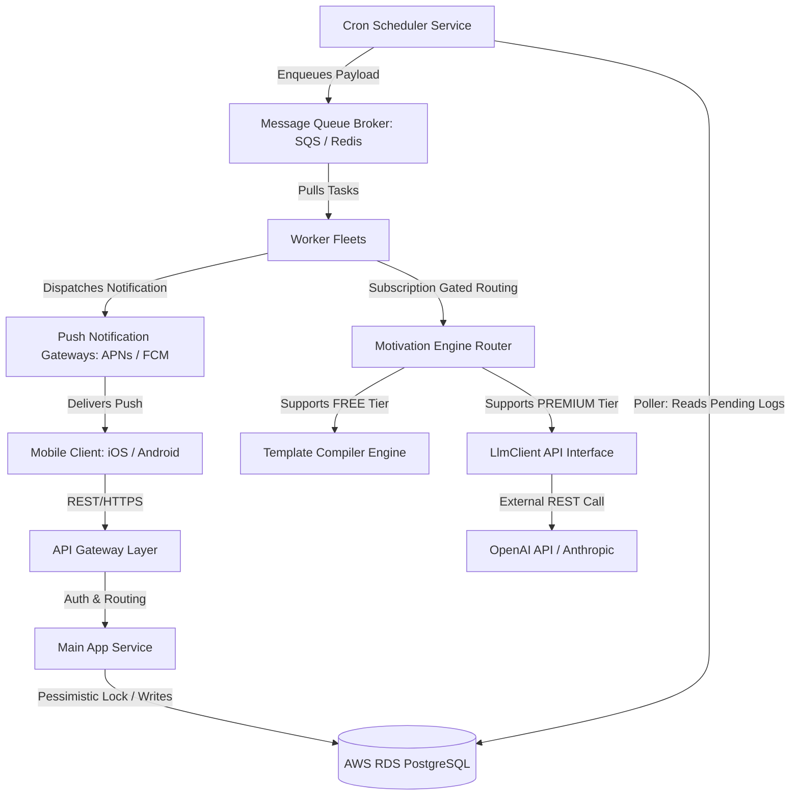

# LockedIn Platform - Technical Requirement Document (TRD)

## Document Control & Metadata
- **Title:** LockedIn Platform Technical Requirement Document (TRD)
- **Status:** Approved / Production Blueprint
- **Version:** v2.0.0
- **Authors:** System Architecture Council & Infrastructure Lead
- **Date:** June 2026

---

## 1. System Non-Functional Requirements (NFRs)

To guarantee high scalability, resilience, and operational safety, the platform enforces the following NFR boundaries:

- **Throughput Capacity:** The background dispatch worker pool must confidently process and route up to **5,000 unique push notifications per second** during critical timezone hour boundaries (e.g., peak wake/sleep hours).
- **Latency Boundary Constraints:** All REST API endpoints handling core user actions (check-ins, configuration updates) must return responses within a latency bound of **P99 < 150ms**.
- **Concurrency & Isolation:** To insulate the database from multi-device double check-ins or race conditions when consuming assets, the system must utilize pessimistic row-level locking (`SELECT FOR UPDATE`) within transaction boundaries.
- **System SLA:** The cron dispatch and messaging systems must maintain a overall uptime of **99.9%**, guaranteeing notification delivery within 60 seconds of the scheduled time.

---

## 2. System Architecture & Topology

The system comprises a modular, service-oriented architecture designed to handle ingestion spikes and asynchronous processing. Below is the Mermaid visualization of the architecture:



### 2.1 Core Subsystems
1. **API Gateway Layer:** Responsible for request routing, JWT token verification, rate limiting, and SSL/TLS termination.
2. **Main App Service (Spring/Java):** Handles user registration, profile setup, and CRUD operations for daily habits.
3. **Cron Scheduler Service:** Runs a minute poll at the start of every minute, querying streaks that are due and have not been logged today, enqueuing them to the Message Queue.
4. **Message Broker (Redis/AWS SQS):** Orchestrates the asynchronous task load, buffering notification task payloads.
5. **Worker Fleets:** Scalable worker instances that consume payloads from the broker, call the polymorphic engine router to compile message templates or request LLMs, and call the Apple Push Notification service (APNs) or Firebase Cloud Messaging (FCM).

---

## 3. Mathematical Timezone Logic Parsing Formula

To prevent false streak penalties for users who execute late-night actions, the platform implements a **Night-Owl Grace Period Window** ($W_g = 3\text{ hours}$).

When a check-in event occurs, the server logs the UTC timestamp ($T_{\text{utc}}$), maps it to the user's registered IANA timezone identifier (e.g., `America/New_York`), producing the user's local wall time ($T_{\text{local}}$). The engine then calculates the logical calendar date using the following relational boundary formula:

$$T_{\text{logical}} = \text{DatePart}(T_{\text{local}} - W_g)$$

### 3.1 Logical Boundary Evaluation Rules
1. **Rule A (Inside Grace Window):** If a user checks in at 01:30 AM local time on Tuesday, the system subtracts 3 hours, resulting in 10:30 PM local time on Monday. The logical calendar date resolves to **Monday**.
2. **Rule B (Outside Grace Window):** If a user checks in at 04:15 AM local time on Tuesday, subtracting 3 hours results in 01:15 AM local time on Tuesday. The logical calendar date resolves to **Tuesday**, and Monday's habit deadline is marked as missed.

Java implementation checks for empty/null timezone IDs and gracefully falls back to UTC to avoid crashing the scheduler pipeline.

---

## 4. Polymorphic Motivation Engine Strategy

The system routes message generation dynamically using a Polymorphic Strategy Pattern based on the user's subscription tier:

- **Interface Contract (`MotivationEngine.java`):**
  - `generateMessage(MotivationContext context)`: Compiles/generates the message text.
  - `supports(String userTier)`: Returns `true` if the engine handles the given tier (e.g., `"FREE"`, `"PREMIUM"`).

- **Template Motivation Engine (Free Tier):**
  - Compiles responses locally using string interpolation over pre-configured template maps.
  - Performance: Highly efficient, zero network latency, P99 < 5ms.

- **AI Motivation Engine (Premium Tier):**
  - Integrates with external LLMs via `LlmClient` to construct custom roasts based on the user's archetype config, specific goal title, and their recorded custom emotional anchor.
  - Performance: Asynchronous HTTP request, P99 < 2s. Buffered by worker pools to avoid blocking API threads.

---

## 5. API Endpoint Contracts

### 5.1 User Habit Check-In
- **Endpoint:** `POST /api/v1/streaks/{streakId}/checkin`
- **Headers:** `Authorization: Bearer <JWT_TOKEN>`
- **Request Body:**
  ```json
  {
    "client_local_timestamp": "2026-06-13T01:30:00+05:30"
  }
  ```
- **Success Response (200 OK):**
  ```json
  {
    "status": "SUCCESS",
    "streak_id": "str_90210",
    "logical_date": "2026-06-12",
    "current_streak_tally": 12,
    "max_streak_tally": 15
  }
  ```

### 5.2 Consume Streak Freeze Token
- **Endpoint:** `POST /api/v1/streaks/{streakId}/freeze`
- **Headers:** `Authorization: Bearer <JWT_TOKEN>`
- **Success Response (200 OK):**
  ```json
  {
    "status": "FROZEN",
    "streak_id": "str_90210",
    "consumed_date": "2026-06-12",
    "remaining_freeze_tokens": 2
  }
  ```
